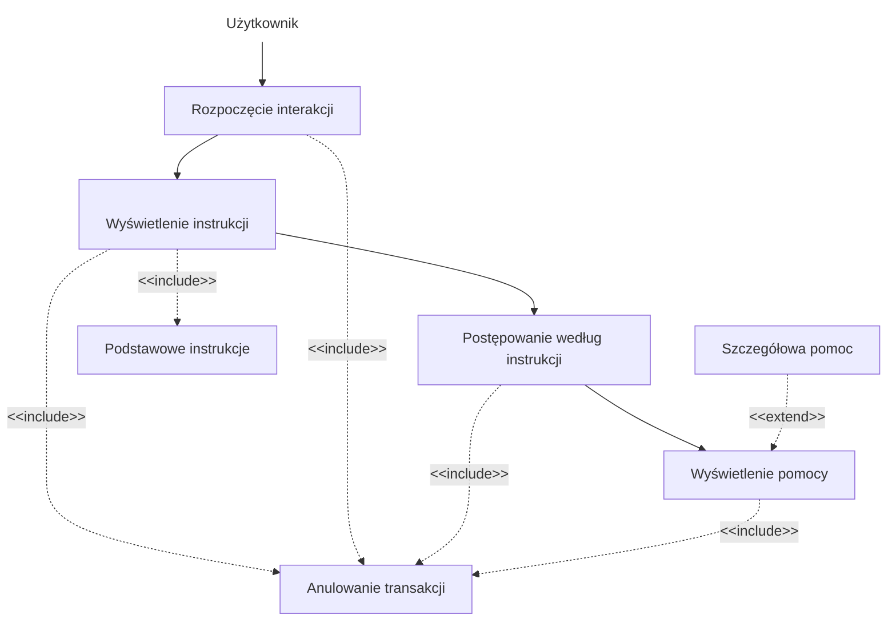
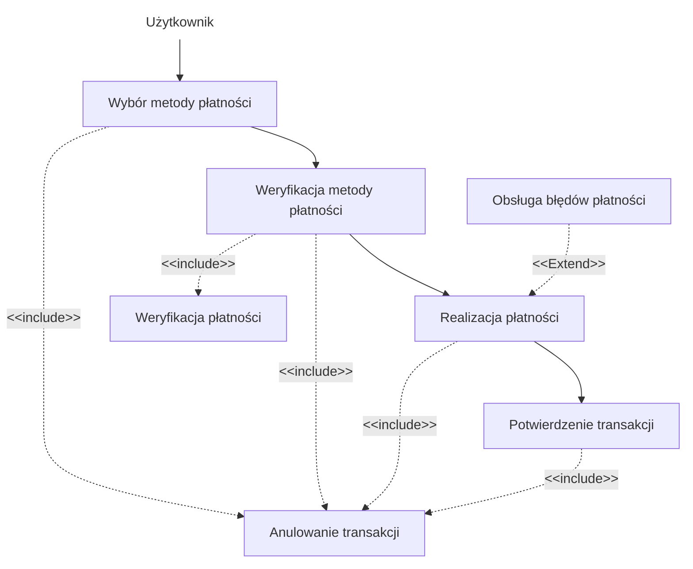

1. Jako użytkownik, chcę szybko wybrać rodzaj biletu, aby zminimalizować czas
spędzony przy biletomacie.
2. Jako użytkownik, chcę mieć możliwość wyboru języka, aby móc korzystać z
biletomatu bez względu na znajomość języka lokalnego.
3. Jako użytkownik, chcę sprawdzić poprawność transakcji przed jej finalizacją,
aby uniknąć pomyłek.
4. Jako użytkownik, chcę otrzymać potwierdzenie zakupu (np. wydruk biletu lub
elektroniczny bilet), aby móc korzystać z transportu zgodnie z przepisami.
5. Jako użytkownik, chcę płacić za bilet kartą, gotówką lub telefonem, aby mieć
większą elastyczność w wyborze metody płatności.
6. Jako użytkownik, chcę otrzymać wyraźne instrukcje na ekranie, aby wiedzieć,
jak dokonać zakupu krok po kroku.
7. Jako użytkownik, chcę widzieć czas pozostały na decyzję (np. wyświetlany
licznik czasu), aby móc szybko podjąć działanie.

## DIAGRAMY PRZYPADKÓW UŻYCIA
### Otrzymanie instrukcji na ekranie



### Sprawdzenie poprawności transakcji

``` mermaid
flowchart TD
    n1["Użytkownik"] --> A["Wybór biletu i płatności"]
    B["Wyświetlenie podsumowania<br>"] --> C["Potwierdzenie lub cofnięcie"]
    B -. "<span style=padding-left:>&lt;&lt;include&gt;&gt;</span>" .-> E["Anulowanie transakcji"] & n2["Podsumowanie transakcji<br>"]
    C --> D["Kontynuacja lub anulowanie"]
    C -. &lt;&lt;include&gt;&gt; .-> E
    A --> B
    A -. "<span style=padding-left:>&lt;&lt;include&gt;&gt;</span>" .-> E
    D -. "<span style=padding-left:>&lt;&lt;include&gt;&gt;</span>" .-> E
    F["Ostrzeżenie o błędzie"] -. "<span style=padding-left:>&lt;&lt;extend&gt;&gt;</span>" .-> D

    n1@{ shape: text}
 ```
    
### Wybór języka

``` mermaid
flowchart TD
    n1["Użytkownik"] --> A["Rozpoczęcie interakcji"]
    A --> B["Wyświetlenie opcji języka"]
    A -. "<span style=padding-left:>&lt;&lt;include&gt;&gt;</span>" .-> n2["Domyślny język<br>"]
    B --> C["Wybór języka"]
    B -. "<span style=padding-left:>&lt;&lt;include&gt;&gt;</span>" .-> G["Anulowanie transakcji"]
    C --> E["Dostosowanie interfejsu <br>"]
    C -. "<span style=padding-left:>&lt;&lt;include&gt;&gt;</span>" .-> G
    A -. &lt;&lt;include&gt;&gt; .-> G
    F["Lista<br>popularnych języków<br>"] -. "<span style=padding-left:>&lt;&lt;extend&gt;&gt;</span>" .-> B
    E -. "<span style=padding-left:>&lt;&lt;include&gt;&gt;</span>" .-> G

    n1@{ shape: text}
```

### Płatność za bilet



## DIAGRAMY SEKWENCJI

### DIAGRAM SEKWENCJI DLA PRZYPADKU UŻYCIA LOGOWANIA UŻYTKOWNIKA

- **AKTOR**: Użytkownik
- **OBIEKTY**: Interfejs logowania, Serwer aplikacji, Baza danych
- **KOLEJNOŚĆ KOMUNIKATÓW**:
  - Użytkownik wysyła dane logowania do interfejsu.
  - Interfejs przekazuje dane do serwera.
  - Serwer wysyła zapytanie do bazy danych.
  - Baza danych odpowiada.
  - Serwer zwraca wynik do interfejsu.
  - Interfejs informuje użytkownika o sukcesie lub błędzie.

#### SCENARIUSZ ALTERNATYWNY 1 (Błędne dane logowania):
- Użytkownik wprowadza błędne dane logowania w formularzu.
- Interfejs logowania przesyła dane do serwera autoryzacji.
- Serwer autoryzacji weryfikuje dane w bazie danych.
- Baza danych zwraca informację o braku dopasowania.
- Serwer zwraca informację o błędzie.
- Interfejs wyświetla komunikat o błędnych danych logowania.

