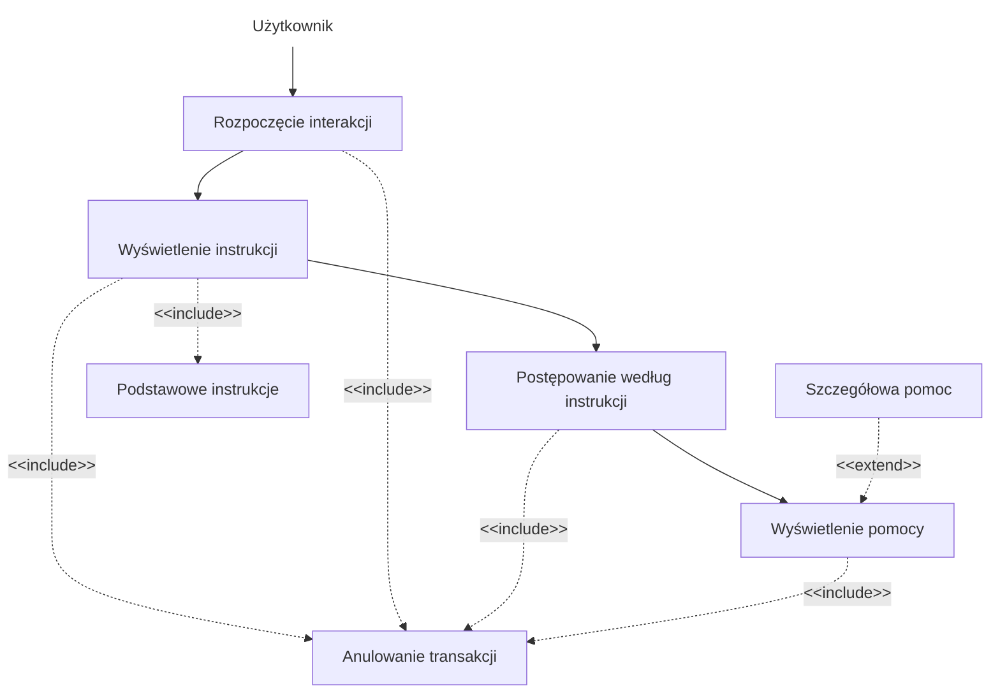
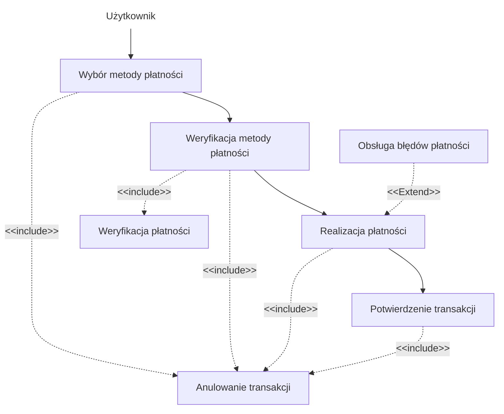
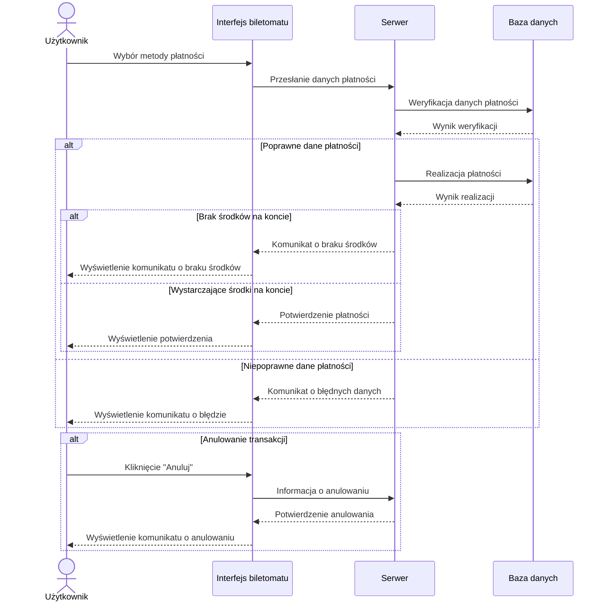

1. Jako użytkownik, chcę szybko wybrać rodzaj biletu, aby zminimalizować czas
spędzony przy biletomacie.
2. Jako użytkownik, chcę mieć możliwość wyboru języka, aby móc korzystać z
biletomatu bez względu na znajomość języka lokalnego.
3. Jako użytkownik, chcę sprawdzić poprawność transakcji przed jej finalizacją,
aby uniknąć pomyłek.
4. Jako użytkownik, chcę otrzymać potwierdzenie zakupu (np. wydruk biletu lub
elektroniczny bilet), aby móc korzystać z transportu zgodnie z przepisami.
5. Jako użytkownik, chcę płacić za bilet kartą, gotówką lub telefonem, aby mieć
większą elastyczność w wyborze metody płatności.
6. Jako użytkownik, chcę otrzymać wyraźne instrukcje na ekranie, aby wiedzieć,
jak dokonać zakupu krok po kroku.
7. Jako użytkownik, chcę widzieć czas pozostały na decyzję (np. wyświetlany
licznik czasu), aby móc szybko podjąć działanie.

## DIAGRAMY PRZYPADKÓW UŻYCIA
### Otrzymanie instrukcji na ekranie



### Sprawdzenie poprawności transakcji

``` mermaid
flowchart TD
    n1["Użytkownik"] --> A["Wybór biletu i płatności"]
    B["Wyświetlenie podsumowania<br>"] --> C["Potwierdzenie lub cofnięcie"]
    B -. "<span style=padding-left:>&lt;&lt;include&gt;&gt;</span>" .-> E["Anulowanie transakcji"] & n2["Podsumowanie transakcji<br>"]
    C --> D["Kontynuacja lub anulowanie"]
    C -. &lt;&lt;include&gt;&gt; .-> E
    A --> B
    A -. "<span style=padding-left:>&lt;&lt;include&gt;&gt;</span>" .-> E
    D -. "<span style=padding-left:>&lt;&lt;include&gt;&gt;</span>" .-> E
    F["Ostrzeżenie o błędzie"] -. "<span style=padding-left:>&lt;&lt;extend&gt;&gt;</span>" .-> D

    n1@{ shape: text}
 ```
    
### Wybór języka

``` mermaid
flowchart TD
    n1["Użytkownik"] --> A["Rozpoczęcie interakcji"]
    A --> B["Wyświetlenie opcji języka"]
    A -. "<span style=padding-left:>&lt;&lt;include&gt;&gt;</span>" .-> n2["Domyślny język<br>"]
    B --> C["Wybór języka"]
    B -. "<span style=padding-left:>&lt;&lt;include&gt;&gt;</span>" .-> G["Anulowanie transakcji"]
    C --> E["Dostosowanie interfejsu <br>"]
    C -. "<span style=padding-left:>&lt;&lt;include&gt;&gt;</span>" .-> G
    A -. &lt;&lt;include&gt;&gt; .-> G
    F["Lista<br>popularnych języków<br>"] -. "<span style=padding-left:>&lt;&lt;extend&gt;&gt;</span>" .-> B
    E -. "<span style=padding-left:>&lt;&lt;include&gt;&gt;</span>" .-> G

    n1@{ shape: text}
```

### Płatność za bilet



## DIAGRAMY SEKWENCJI

### DIAGRAM SEKWENCJI DLA PRZYPADKU UŻYCIA PŁATNOŚĆ ZA BILET

### SCENARIUSZ GŁÓWNY
- **AKTOR**: Użytkownik  
- **OBIEKTY**: Interfejs biletomatu, Serwer, Baza danych  
- **KOLEJNOŚĆ KOMUNIKATÓW**:  
  1. Użytkownik wybiera metodę płatności w interfejsie biletomatu.  
  2. Interfejs biletomatu przesyła dane płatności do serwera.  
  3. Serwer wysyła żądanie weryfikacji danych płatności do bazy danych.  
  4. Baza danych zwraca wynik weryfikacji do serwera.  
  5. Serwer inicjuje realizację płatności, przesyłając żądanie do bazy danych.  
  6. Baza danych przetwarza transakcję i zwraca wynik realizacji do serwera.  
  7. Serwer przesyła potwierdzenie realizacji płatności do interfejsu biletomatu.  
  8. Interfejs biletomatu wyświetla użytkownikowi potwierdzenie pomyślnej płatności.  

### SCENARIUSZ ALTERNATYWNY 1: (Niepoprawne dane płatności)
- **KOLEJNOŚĆ KOMUNIKATÓW**:  
  1. Użytkownik wybiera metodę płatności i wprowadza błędne dane w interfejsie biletomatu.  
  2. Interfejs biletomatu przesyła dane do serwera.  
  3. Serwer wysyła żądanie weryfikacji danych płatności do bazy danych.  
  4. Baza danych zwraca wynik weryfikacji informujący o błędnych danych.  
  5. Serwer przesyła komunikat o błędnych danych do interfejsu biletomatu.  
  6. Interfejs biletomatu wyświetla użytkownikowi komunikat o błędnych danych płatności.  

### SCENARIUSZ ALTERNATYWNY 2: (Brak środków na koncie)
- **KOLEJNOŚĆ KOMUNIKATÓW**:  
  1. Użytkownik wybiera metodę płatności i wprowadza poprawne dane w interfejsie biletomatu.  
  2. Interfejs biletomatu przesyła dane do serwera.  
  3. Serwer wysyła żądanie realizacji płatności do bazy danych.  
  4. Baza danych zwraca wynik weryfikacji informujący o braku środków na koncie.  
  5. Serwer przesyła komunikat o braku środków do interfejsu biletomatu.  
  6. Interfejs biletomatu wyświetla użytkownikowi komunikat o braku środków na koncie.  

### SCENARIUSZ ALTERNATYWNY 3: (Anulowanie transakcji przez użytkownika)
- **KOLEJNOŚĆ KOMUNIKATÓW**:  
  1. Użytkownik klika przycisk "Anuluj" w interfejsie biletomatu.  
  2. Interfejs biletomatu przesyła informację o anulowaniu transakcji do serwera.  
  3. Serwer potwierdza anulowanie transakcji i przesyła potwierdzenie do interfejsu biletomatu.  
  4. Interfejs biletomatu wyświetla użytkownikowi komunikat o anulowaniu transakcji.  


