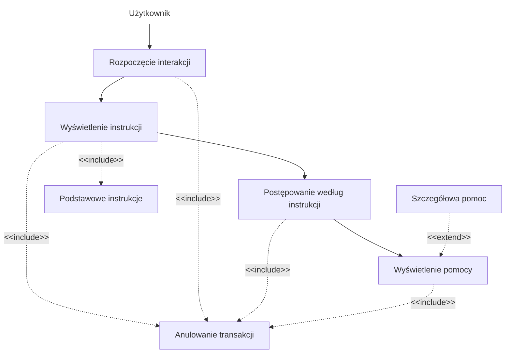
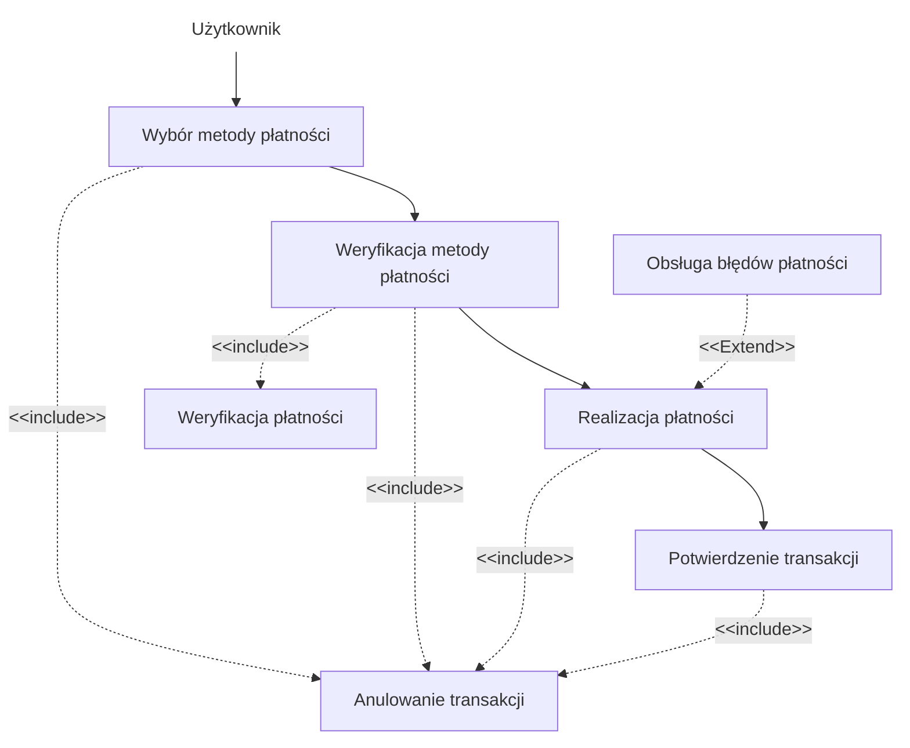
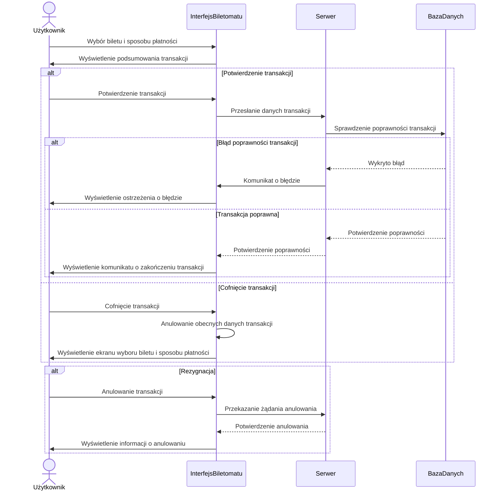
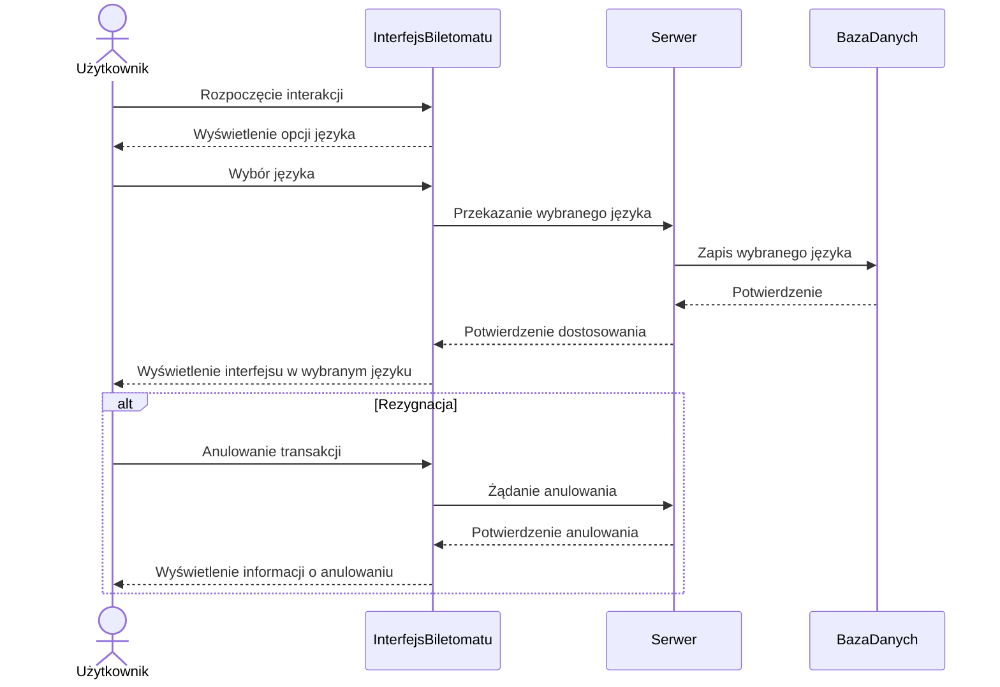
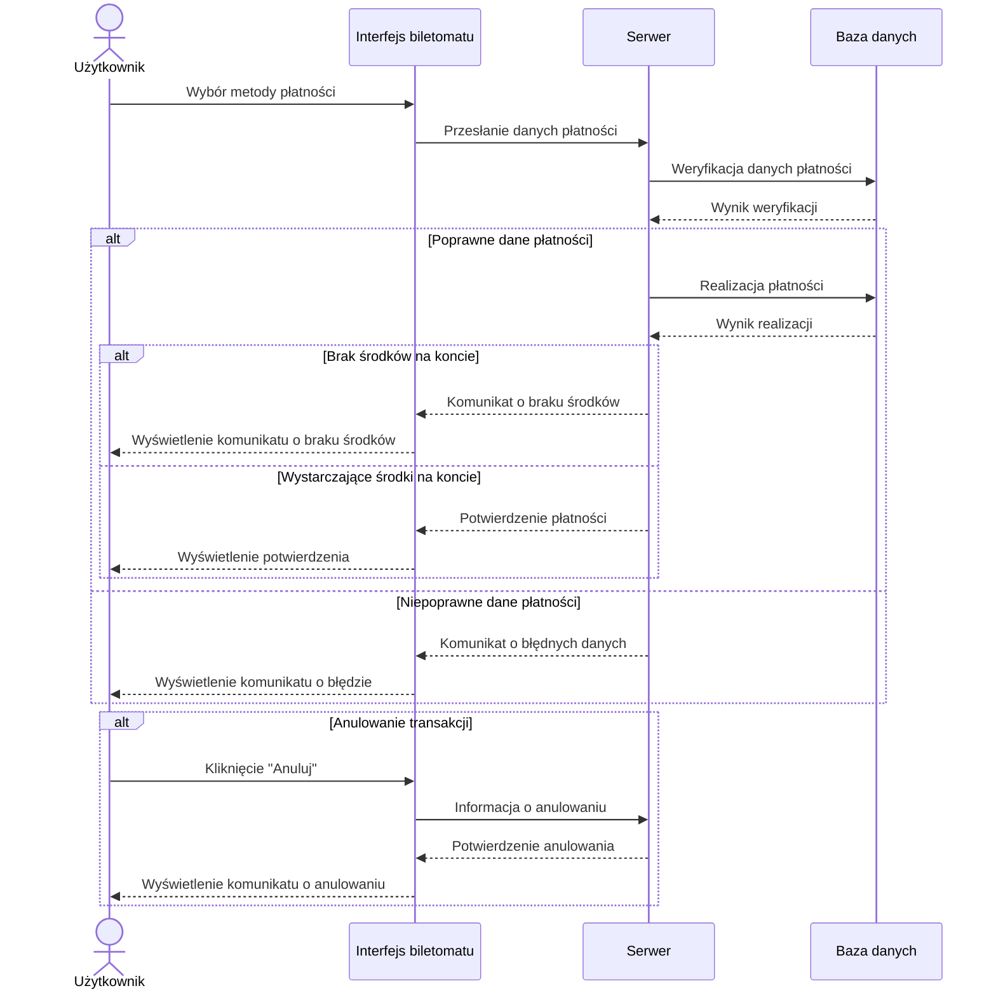
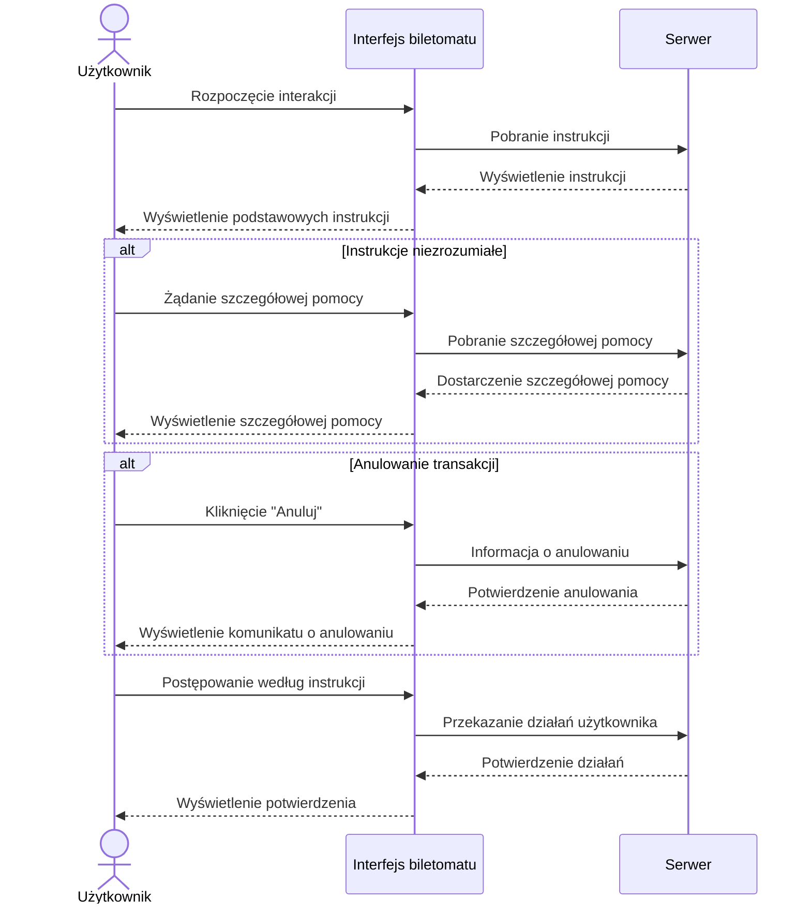
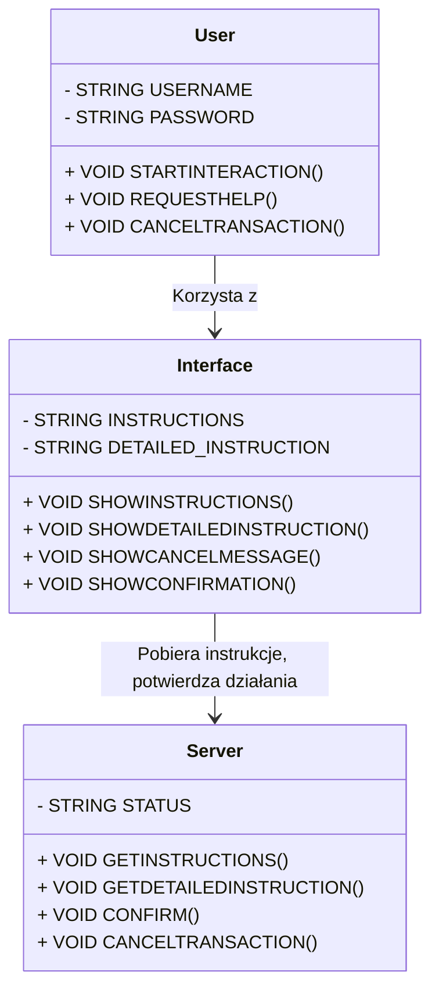
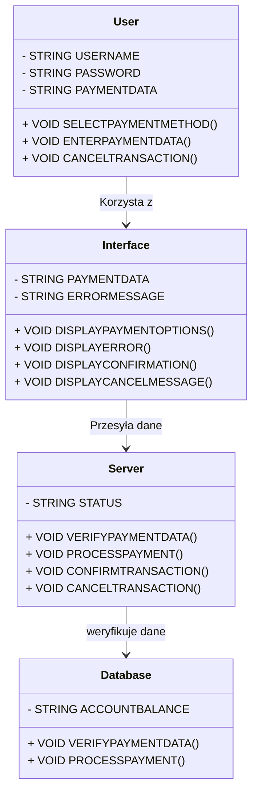
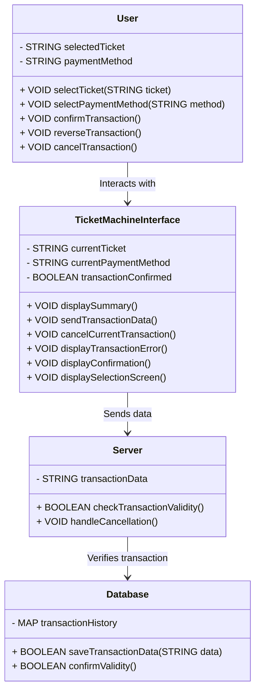

1. Jako użytkownik, chcę szybko wybrać rodzaj biletu, aby zminimalizować czas
spędzony przy biletomacie.
2. Jako użytkownik, chcę mieć możliwość wyboru języka, aby móc korzystać z
biletomatu bez względu na znajomość języka lokalnego.
3. Jako użytkownik, chcę sprawdzić poprawność transakcji przed jej finalizacją,
aby uniknąć pomyłek.
4. Jako użytkownik, chcę otrzymać potwierdzenie zakupu (np. wydruk biletu lub
elektroniczny bilet), aby móc korzystać z transportu zgodnie z przepisami.
5. Jako użytkownik, chcę płacić za bilet kartą, gotówką lub telefonem, aby mieć
większą elastyczność w wyborze metody płatności.
6. Jako użytkownik, chcę otrzymać wyraźne instrukcje na ekranie, aby wiedzieć,
jak dokonać zakupu krok po kroku.
7. Jako użytkownik, chcę widzieć czas pozostały na decyzję (np. wyświetlany
licznik czasu), aby móc szybko podjąć działanie.

## DIAGRAMY PRZYPADKÓW UŻYCIA
### Otrzymanie instrukcji na ekranie



### Sprawdzenie poprawności transakcji

``` mermaid
flowchart TD
    n1["Użytkownik"] --> A["Wybór biletu i płatności"]
    B["Wyświetlenie podsumowania<br>"] --> C["Potwierdzenie lub cofnięcie"]
    B -. "<span style=padding-left:>&lt;&lt;include&gt;&gt;</span>" .-> E["Anulowanie transakcji"] & n2["Podsumowanie transakcji<br>"]
    C --> D["Kontynuacja lub anulowanie"]
    C -. &lt;&lt;include&gt;&gt; .-> E
    A --> B
    A -. "<span style=padding-left:>&lt;&lt;include&gt;&gt;</span>" .-> E
    D -. "<span style=padding-left:>&lt;&lt;include&gt;&gt;</span>" .-> E
    F["Ostrzeżenie o błędzie"] -. "<span style=padding-left:>&lt;&lt;extend&gt;&gt;</span>" .-> D

    n1@{ shape: text}
 ```
    
### Wybór języka

``` mermaid
flowchart TD
    n1["Użytkownik"] --> A["Rozpoczęcie interakcji"]
    A --> B["Wyświetlenie opcji języka"]
    A -. "<span style=padding-left:>&lt;&lt;include&gt;&gt;</span>" .-> n2["Domyślny język<br>"]
    B --> C["Wybór języka"]
    B -. "<span style=padding-left:>&lt;&lt;include&gt;&gt;</span>" .-> G["Anulowanie transakcji"]
    C --> E["Dostosowanie interfejsu <br>"]
    C -. "<span style=padding-left:>&lt;&lt;include&gt;&gt;</span>" .-> G
    A -. &lt;&lt;include&gt;&gt; .-> G
    F["Lista<br>popularnych języków<br>"] -. "<span style=padding-left:>&lt;&lt;extend&gt;&gt;</span>" .-> B
    E -. "<span style=padding-left:>&lt;&lt;include&gt;&gt;</span>" .-> G

    n1@{ shape: text}
```

### Płatność za bilet



## DIAGRAMY SEKWENCJI

### DIAGRAM SEKWENCJI DLA PRZYPADKU UŻYCIA SPRAWDZENIE POPRAWNOŚCI TRANSAKCJI

### SCENARIUSZ GŁÓWNY
- **AKTOR**: Użytkownik
- **OBIEKTY**: Interfejs biletomatu, Serwer, BazaDanych
- **KOLEJNOŚĆ KOMUNIKATÓW**:
  1. Użytkownik wybiera bilet i sposób płatności.
  2. Interfejs biletomatu wyświetla podsumowanie transakcji.
  3. Użytkownik potwierdza transakcję.
  4. Interfejs biletomatu przesyła dane transakcji do serwera.
  5. Serwer sprawdza poprawność transakcji w bazie danych.
  6. Serwer potwierdza poprawność transakcji.
  7. Interfejs biletomatu wyświetla komunikat o zakończeniu transakcji.

---

### SCENARIUSZ ALTERNATYWNY 1: (Cofnięcie transakcji)
- **KOLEJNOŚĆ KOMUNIKATÓW**:
  1. Użytkownik cofa transakcję.
  2. Interfejs biletomatu anuluje obecne dane transakcji.
  3. Interfejs biletomatu wyświetla ekran wyboru biletu i sposobu płatności.

---

### SCENARIUSZ ALTERNATYWNY 2: (Rezygnacja)
- **KOLEJNOŚĆ KOMUNIKATÓW**:
  1. Użytkownik rozpoczyna interakcję.
  2. Interfejs biletomatu wyświetla opcje języka.
  3. Użytkownik wybiera język.
  4. Interfejs biletomatu przesyła wybór do serwera.
  5. Serwer zapisuje dane w bazie.
  6. Interfejs biletomatu wyświetla interfejs w wybranym języku.

---

### SCENARIUSZ ALTERNATYWNY 3: (Błąd)
- **KOLEJNOŚĆ KOMUNIKATÓW**:
  1. Serwer wykrywa błąd poprawności transakcji
  2. Serwer przesyła komunikat o błędzie do interfejsu biletomatu.
  3. Interfejs biletomatu wyświetla użytkownikowi ostrzeżenie o błędzie.

### WIZUALIZACJA DIAGRAMU SEKWENCJI


### DIAGRAM SEKWENCJI DLA PRZYPADKU UŻYCIA WYBÓR JĘZYKA

### SCENARIUSZ GŁÓWNY
- **AKTOR**: Użytkownik
- **OBIEKTY**: Interfejs biletomatu, Serwer, BazaDanych
- **KOLEJNOŚĆ KOMUNIKATÓW**:
  1. Użytkownik rozpoczyna interakcję.
  2. Interfejs biletomatu wyświetla opcje języka.
  3. Użytkownik wybiera język.
  4. Interfejs biletomatu przesyła wybór do serwera.
  5. Serwer zapisuje dane w bazie.
  6. Interfejs biletomatu wyświetla interfejs w wybranym języku.

### SCENARIUSZ ALTERNATYWNY: Rezygnacja
- **KOLEJNOŚĆ KOMUNIKATÓW**:
  1. Użytkownik anuluje transakcję.
  2. Interfejs biletomatu przekazuje żądanie anulowania do serwera.
  3. Serwer potwierdza anulowanie interakcji.
  4. Interfejs biletomatu wyświetla informację o anulowaniu.

### WIZUALIZACJA DIAGRAMU SEKWENCJI


### DIAGRAM SEKWENCJI DLA PRZYPADKU UŻYCIA PŁATNOŚĆ ZA BILET

### SCENARIUSZ GŁÓWNY
- **AKTOR**: Użytkownik  
- **OBIEKTY**: Interfejs biletomatu, Serwer, Baza danych  
- **KOLEJNOŚĆ KOMUNIKATÓW**:  
  1. Użytkownik wybiera metodę płatności w interfejsie biletomatu.  
  2. Interfejs biletomatu przesyła dane płatności do serwera.  
  3. Serwer wysyła żądanie weryfikacji danych płatności do bazy danych.  
  4. Baza danych zwraca wynik weryfikacji do serwera.  
  5. Serwer inicjuje realizację płatności, przesyłając żądanie do bazy danych.  
  6. Baza danych przetwarza transakcję i zwraca wynik realizacji do serwera.  
  7. Serwer przesyła potwierdzenie realizacji płatności do interfejsu biletomatu.  
  8. Interfejs biletomatu wyświetla użytkownikowi potwierdzenie pomyślnej płatności.  

### SCENARIUSZ ALTERNATYWNY 1: (Niepoprawne dane płatności)
- **KOLEJNOŚĆ KOMUNIKATÓW**:  
  1. Użytkownik wybiera metodę płatności i wprowadza błędne dane w interfejsie biletomatu.  
  2. Interfejs biletomatu przesyła dane do serwera.  
  3. Serwer wysyła żądanie weryfikacji danych płatności do bazy danych.  
  4. Baza danych zwraca wynik weryfikacji informujący o błędnych danych.  
  5. Serwer przesyła komunikat o błędnych danych do interfejsu biletomatu.  
  6. Interfejs biletomatu wyświetla użytkownikowi komunikat o błędnych danych płatności.  

### SCENARIUSZ ALTERNATYWNY 2: (Brak środków na koncie)
- **KOLEJNOŚĆ KOMUNIKATÓW**:  
  1. Użytkownik wybiera metodę płatności i wprowadza poprawne dane w interfejsie biletomatu.  
  2. Interfejs biletomatu przesyła dane do serwera.  
  3. Serwer wysyła żądanie realizacji płatności do bazy danych.  
  4. Baza danych zwraca wynik weryfikacji informujący o braku środków na koncie.  
  5. Serwer przesyła komunikat o braku środków do interfejsu biletomatu.  
  6. Interfejs biletomatu wyświetla użytkownikowi komunikat o braku środków na koncie.  

### SCENARIUSZ ALTERNATYWNY 3: (Anulowanie transakcji przez użytkownika)
- **KOLEJNOŚĆ KOMUNIKATÓW**:  
  1. Użytkownik klika przycisk "Anuluj" w interfejsie biletomatu.  
  2. Interfejs biletomatu przesyła informację o anulowaniu transakcji do serwera.  
  3. Serwer potwierdza anulowanie transakcji i przesyła potwierdzenie do interfejsu biletomatu.  
  4. Interfejs biletomatu wyświetla użytkownikowi komunikat o anulowaniu transakcji.  

### WIZUALIZACJA DIAGRAMU SEKWENCJI


### DIAGRAM SEKWENCJI DLA PRZYPADKU UŻYCIA WYŚWIETLANIE INSTRUKCJI

### SCENARIUSZ GŁÓWNY
- **AKTOR**: Użytkownik  
- **OBIEKTY**: Interfejs aplikacji, Serwer  
- **KOLEJNOŚĆ KOMUNIKATÓW**:  
  1. Użytkownik rozpoczyna interakcję w interfejsie biletomatu.  
  2. Interfejs biletomatu przesyła żądanie pobrania instrukcji do serwera.  
  3. Serwer zwraca instrukcje do interfejsu biletomatu.  
  4. Interfejs biletomatu wyświetla użytkownikowi podstawowe instrukcje.  
  5. Użytkownik postępuje zgodnie z wyświetlonymi instrukcjami.  
  6. Interfejs biletomatu przesyła działania użytkownika do serwera.  
  7. Serwer potwierdza poprawność działań użytkownika.  
  8. Interfejs biletomatu wyświetla użytkownikowi potwierdzenie wykonania działań.  

### SCENARIUSZ ALTERNATYWNY 1: (Instrukcje niezrozumiałe)
- **KOLEJNOŚĆ KOMUNIKATÓW**:  
  1. Użytkownik zgłasza żądanie szczegółowej pomocy w interfejsie biletomatu.  
  2. Interfejs biletomatu przesyła żądanie szczegółowej pomocy do serwera.  
  3. Serwer dostarcza szczegółowe instrukcje do interfejsu biletomatu.  
  4. Interfejs biletomatu wyświetla użytkownikowi szczegółowe instrukcje.  

### SCENARIUSZ ALTERNATYWNY 2: (Anulowanie transakcji)
- **KOLEJNOŚĆ KOMUNIKATÓW**:  
  1. Użytkownik klika przycisk "Anuluj" w interfejsie biletomatu.  
  2. Interfejs aplikacji przesyła informację o anulowaniu transakcji do serwera.  
  3. Serwer potwierdza anulowanie transakcji i przesyła potwierdzenie do interfejsu biletomatu.  
  4. Interfejs biletomatu wyświetla użytkownikowi komunikat o anulowaniu transakcji.  

### WIZUALIZACJA DIAGRAMU SEKWENCJI

## DIAGRAMY KLAS
### Otrzymanie instrukcji na ekranie

## OPIS KLAS

### KLASY

#### USER
 -ATRYBUTY: `STRING USERNAMENAME`, `STRING PASSWORD`
 -METODY: `VOID STARTINTERACTION()`, `VOID REQUESTHELP()`, `VOID CANCELTRANSACTION()`

#### INTERFACE
 -ATRYBUTY: `STRING INSTRUCTIONS`, `STRING DETAILED_INSTRUCTION`
 -METODY: `VOID SHOWINSTRUCTIONS()`, `VOID SHOWDETAILEDINSTRUCTION()`, `VOID SHOWCANCELMESSAGE()`, `VOID SHOWCONFIRMATION()`

#### SERVER
 -ATRYBUTY: `STRING STATUS`
 -METODY: `VOID GETINSTRUCTIONS()`, `VOID GETDETAILEDINSTRUCTION()`, `VOID CONFIRM()`, `VOID CANCELTRANSACTION()`

### RELACJE:
- `USER` KORZYSTA Z `INTERFACE`.
- `INTERFACE` UŻYWA `SERVER` DO POBIERANIA INSTRUKCJI I POTWIERDZANIA DZIAŁAŃ.

### WIZUALIZACJA DIAGRAMU KLAS


### Płatność za bilet

## OPIS KLAS

### KLASY

#### USER
 -ATRYBUTY: `STRING NAME`, `STRING PAYMENTDATA`
 -METODY: `VOID SELECTPAYMENTMETHOD()`, `VOID ENTERPAYMENTDATA()`, `VOID CANCELTRANSACTION()`

#### INTERFACE
 -ATRYBUTY: `STRING PAYMENTDATA`, `STRING ERRORMESSAGE`
 -METODY: `VOID DISPLAYPAYMENTOPTIONS()`, `VOID DISPLAYERROR()`, `VOID DISPLAYCONFIRMATION()`, `VOID DISPLAYCANCELMESSAGE()`

#### SERVER
 -ATRYBUTY: `STRING STATUS`
 -METODY: `VOID VERIFYPAYMENTDATA()`, `VOID PROCESSPAYMENT()`, `VOID CONFIRMTRANSACTION()`, `VOID CANCELTRANSACTION()`

#### DATABASE
 -ATRYBUTY: `STRING ACCOUNTBALANCE`
 -METODY: `VOID VERIFYPAYMENTDATA()`, `VOID PROCESSPAYMENT()`

### RELACJE:
- `USER` KORZYSTA Z `INTERFACE` DO WYBORU METODY PŁATNOŚCI.
- `INTERFACE` UŻYWA `SERVER` DO PRZESYŁANIA DANYCH PŁATNOŚCI.
- `SERVER` WERYFIKUJE DANE PŁATNOŚCI PRZY POMOCY `DATABASE`.

### WIZUALIZACJA DIAGRAMU KLAS


### Sprawdzenie poprawności transakcji

## OPIS KLAS

#### KLASY

##### User
- **ATRYBUTY**:
  - `STRING selectedTicket`
  - `STRING paymentMethod`
- **METODY**:
  - `VOID selectTicket(STRING ticket)`
  - `VOID selectPaymentMethod(STRING method)`
  - `VOID confirmTransaction()`
  - `VOID reverseTransaction()`
  - `VOID cancelTransaction()`

##### TicketMachineInterface
- **ATRYBUTY**:
  - `STRING currentTicket`
  - `STRING currentPaymentMethod`
  - `BOOLEAN transactionConfirmed`
- **METODY**:
  - `VOID displaySummary()`
  - `VOID sendTransactionData()`
  - `VOID cancelCurrentTransaction()`
  - `VOID displayTransactionError()`
  - `VOID displayConfirmation()`
  - `VOID displaySelectionScreen()`

##### Server
- **ATRYBUTY**:
  - `STRING transactionData`
- **METODY**:
  - `BOOLEAN checkTransactionValidity()`
  - `VOID handleCancellation()`

##### Database
- **ATRYBUTY**:
  - `MAP<STRING, BOOLEAN> transactionHistory`
- **METODY**:
  - `BOOLEAN saveTransactionData(STRING data)`
  - `BOOLEAN confirmValidity()`

### RELACJE:
1. **User** komunikuje się z **TicketMachineInterface** przez wybór biletu, metody płatności oraz potwierdzenie, cofnięcie lub anulowanie transakcji.
2. **TicketMachineInterface** przesyła dane do **Server** za pomocą metody `sendTransactionData()` i odbiera od niego wyniki sprawdzania transakcji.
3. **Server** korzysta z **Database** do weryfikacji poprawności transakcji i jej zapisu.
4. **Database** zwraca wynik weryfikacji transakcji do **Server**.

---

### WIZUALIZACJA DIAGRAMU KLAS
