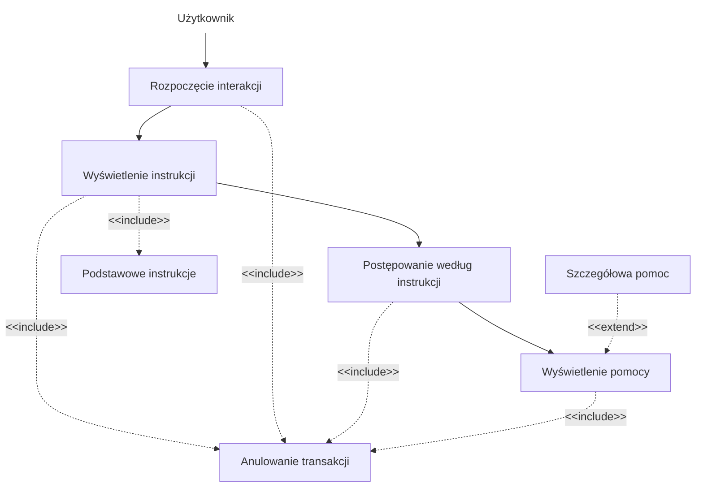
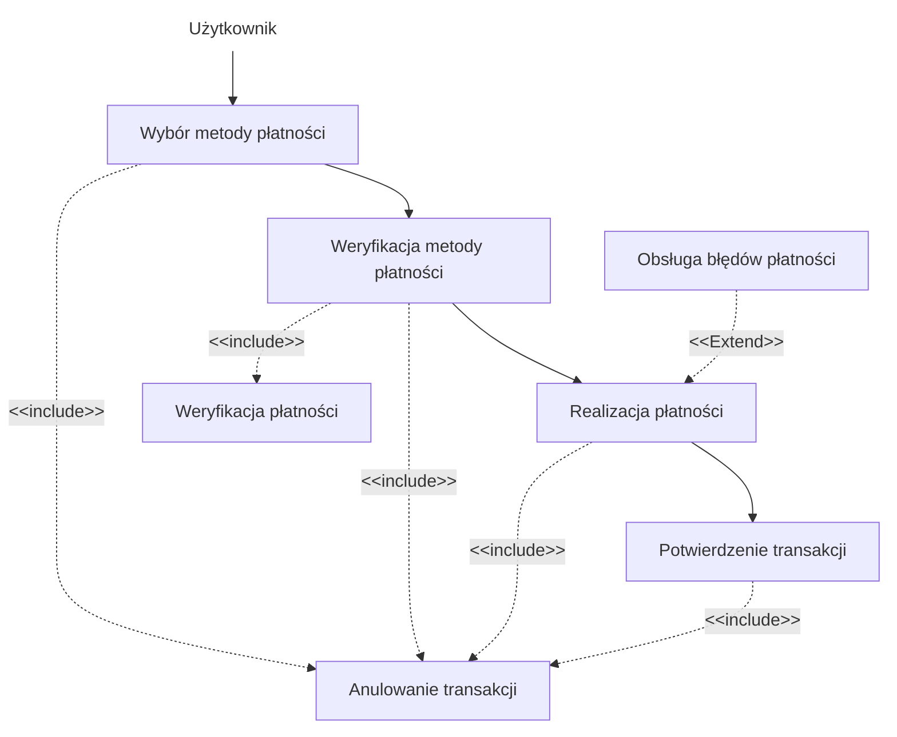
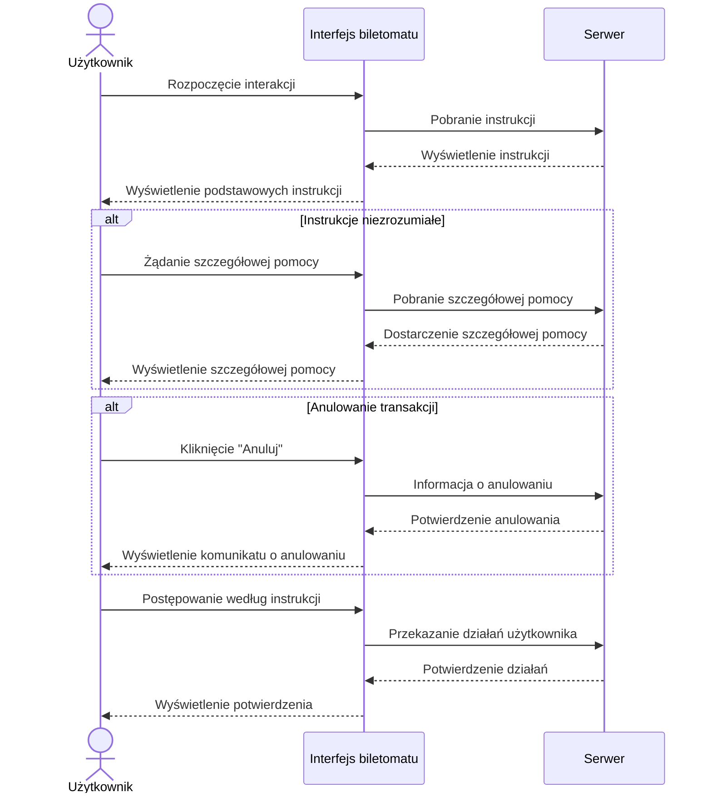

1. Jako użytkownik, chcę szybko wybrać rodzaj biletu, aby zminimalizować czas
spędzony przy biletomacie.
2. Jako użytkownik, chcę mieć możliwość wyboru języka, aby móc korzystać z
biletomatu bez względu na znajomość języka lokalnego.
3. Jako użytkownik, chcę sprawdzić poprawność transakcji przed jej finalizacją,
aby uniknąć pomyłek.
4. Jako użytkownik, chcę otrzymać potwierdzenie zakupu (np. wydruk biletu lub
elektroniczny bilet), aby móc korzystać z transportu zgodnie z przepisami.
5. Jako użytkownik, chcę płacić za bilet kartą, gotówką lub telefonem, aby mieć
większą elastyczność w wyborze metody płatności.
6. Jako użytkownik, chcę otrzymać wyraźne instrukcje na ekranie, aby wiedzieć,
jak dokonać zakupu krok po kroku.
7. Jako użytkownik, chcę widzieć czas pozostały na decyzję (np. wyświetlany
licznik czasu), aby móc szybko podjąć działanie.

## DIAGRAMY PRZYPADKÓW UŻYCIA
### Otrzymanie instrukcji na ekranie



### Sprawdzenie poprawności transakcji

``` mermaid
flowchart TD
    n1["Użytkownik"] --> A["Wybór biletu i płatności"]
    B["Wyświetlenie podsumowania<br>"] --> C["Potwierdzenie lub cofnięcie"]
    B -. "<span style=padding-left:>&lt;&lt;include&gt;&gt;</span>" .-> E["Anulowanie transakcji"] & n2["Podsumowanie transakcji<br>"]
    C --> D["Kontynuacja lub anulowanie"]
    C -. &lt;&lt;include&gt;&gt; .-> E
    A --> B
    A -. "<span style=padding-left:>&lt;&lt;include&gt;&gt;</span>" .-> E
    D -. "<span style=padding-left:>&lt;&lt;include&gt;&gt;</span>" .-> E
    F["Ostrzeżenie o błędzie"] -. "<span style=padding-left:>&lt;&lt;extend&gt;&gt;</span>" .-> D

    n1@{ shape: text}
 ```
    
### Wybór języka

``` mermaid
flowchart TD
    n1["Użytkownik"] --> A["Rozpoczęcie interakcji"]
    A --> B["Wyświetlenie opcji języka"]
    A -. "<span style=padding-left:>&lt;&lt;include&gt;&gt;</span>" .-> n2["Domyślny język<br>"]
    B --> C["Wybór języka"]
    B -. "<span style=padding-left:>&lt;&lt;include&gt;&gt;</span>" .-> G["Anulowanie transakcji"]
    C --> E["Dostosowanie interfejsu <br>"]
    C -. "<span style=padding-left:>&lt;&lt;include&gt;&gt;</span>" .-> G
    A -. &lt;&lt;include&gt;&gt; .-> G
    F["Lista<br>popularnych języków<br>"] -. "<span style=padding-left:>&lt;&lt;extend&gt;&gt;</span>" .-> B
    E -. "<span style=padding-left:>&lt;&lt;include&gt;&gt;</span>" .-> G

    n1@{ shape: text}
```

### Płatność za bilet



## DIAGRAMY SEKWENCJI

### DIAGRAM SEKWENCJI DLA PRZYPADKU UŻYCIA WYŚWIETLANIE INSTRUKCJI

### SCENARIUSZ GŁÓWNY
- **AKTOR**: Użytkownik  
- **OBIEKTY**: Interfejs aplikacji, Serwer  
- **KOLEJNOŚĆ KOMUNIKATÓW**:  
  1. Użytkownik rozpoczyna interakcję w interfejsie aplikacji.  
  2. Interfejs aplikacji przesyła żądanie pobrania instrukcji do serwera.  
  3. Serwer zwraca instrukcje do interfejsu aplikacji.  
  4. Interfejs aplikacji wyświetla użytkownikowi podstawowe instrukcje.  
  5. Użytkownik postępuje zgodnie z wyświetlonymi instrukcjami.  
  6. Interfejs aplikacji przesyła działania użytkownika do serwera.  
  7. Serwer potwierdza poprawność działań użytkownika.  
  8. Interfejs aplikacji wyświetla użytkownikowi potwierdzenie wykonania działań.  

### SCENARIUSZ ALTERNATYWNY 1: (Instrukcje niezrozumiałe)
- **KOLEJNOŚĆ KOMUNIKATÓW**:  
  1. Użytkownik zgłasza żądanie szczegółowej pomocy w interfejsie aplikacji.  
  2. Interfejs aplikacji przesyła żądanie szczegółowej pomocy do serwera.  
  3. Serwer dostarcza szczegółowe instrukcje do interfejsu aplikacji.  
  4. Interfejs aplikacji wyświetla użytkownikowi szczegółowe instrukcje.  

### SCENARIUSZ ALTERNATYWNY 2: (Anulowanie transakcji)
- **KOLEJNOŚĆ KOMUNIKATÓW**:  
  1. Użytkownik klika przycisk "Anuluj" w interfejsie aplikacji.  
  2. Interfejs aplikacji przesyła informację o anulowaniu transakcji do serwera.  
  3. Serwer potwierdza anulowanie transakcji i przesyła potwierdzenie do interfejsu aplikacji.  
  4. Interfejs aplikacji wyświetla użytkownikowi komunikat o anulowaniu transakcji.  



